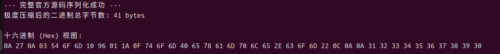
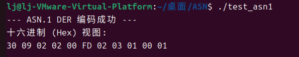

# Protobuf，ASN.1，Kaitai Struct调研

## 执行摘要 

本次调研对 Protocol Buffers、ASN.1 与 Kaitai Struct 三种常见的结构化数据描述与二进制处理方案进行了对比分析。调研结果表明，三者在设计目标、编码模型和适用场景上有明显差异，不适合简单视为同类替代方案。

- Protocol Buffers（Protobuf）是一种面向结构化数据交换的序列化机制。它通过将字段名移出线格式、使用字段号标识字段，并结合 Varint 等编码机制，在很多场景下实现较高的传输效率和较小的消息体积，常用于跨语言服务通信与 RPC 场景，例如 gRPC。
- ASN.1 是通信与安全领域广泛使用的抽象数据描述标准。它通常与 BER、DER、PER 等编码规则配合使用，其中 DER 等规则能够提供确定性的二进制表示，因此在 X.509 证书、通信信令、密码协议等对标准化和一致性要求较高的场景中应用广泛。
- Kaitai Struct 更适合逆向工程、文件格式分析和数据取证等场景。它不定义新的统一交换协议，而是通过声明式的 .ksy 文件描述既有二进制格式的结构，从而生成对应语言的解析器代码，在解析复杂文件格式和已有协议时具有明显的工程优势。

## Protobuf（**Protocol Buffers**）

### 简介：

 Protobuf是Google推出的、与语言和平台无关的结构化数据序列化机制。它使用.proto文件描述消息结构，再通过protoc生成多种目标语言的数据类型与编解码代码。它的设计目标是在保证跨语言兼容性的同时，以较低的编码开销和较小的消息体积完成对象与二进制数据之间的转换。

### 核心机制：

- **字段名的彻底消亡：** 在 JSON 或 XML 中，`"first_name": "John"`​ 会原封不动地存入文件。但在 Protobuf 的机制里，一旦执行序列化，字段名不会直接出现在线格式中，取而代之的是字段号和线格式类型信息。这是 Protobuf 消息通常较紧凑的重要原因之一。 二进制文件中绝不会出现这些字符串，取而代之的是它们对应的 **Tag Number**。
- **Tag 与 Wire Type 的融合：** 其线格式可以理解为一种以字段号为核心的键值式编码机制。 二进制流中的每一个数据块，开头都是一个由 **Tag Number** 和 **Wire Type（底层数据类型，比如它是变长整数还是字符串）**  经过位运算（`(field_number << 3) | wire_type`）合并而成的一个 varint 编码的 key（常见字段号可为 1 字节，但字段号较大时会变长）。
- **Varint 编码与 ZigZag 压缩**：Protobuf 对许多数值类型使用 Varint（可变长整数）编码，数值越小，占用字节通常越少。需要注意的是，ZigZag 并不是所有有符号整数的通用规则，而是 sint32/sint64 这类字段类型的编码方式；int32/int64 的负数并不会获得同样的压缩效果。

  Varint 的原理是拿出一个字节的最高位（MSB）作为“标志位”：

  - 如果 MSB 是 `1`，表示“下一个字节还是这个数字的一部分”。
  - 如果 MSB 是 `0`，表示“这个数字到此结束”。

‍

### 工作流程：

1. 编写数据契约（`.proto`​ 文件）：开发者在这里定义数据的层级结构、字段类型和最重要的 **Tag Number（标签号）** 。
2. 编译器生成代码：Protobuf 本身只是一种规范，要让程序能用它，必须借助于官方的 `protoc` 编译器。
3. 数据赋值与序列化：生成代码后，就可以在实际业务中使用了。

### 样例分析：

1. **代码来源**：[语言指南（原型3）|协议缓冲区文档](https://protobuf.dev/programming-guides/proto3/)

- **核心**  **​`.proto`​**​ **代码片段**

```proto
syntax = "proto3";

message SearchRequest {
  string query = 1;         // 这里的 = 1 是 Tag Number，不是默认值
  int32 page_number = 2;    // int32 在底层使用 Varint 编码压缩
  int32 result_per_page = 3;
}

message Person {
  string name = 1;
  int32 id = 2;
  bool has_ponycopter = 3;
}
```

- **Tag Number：**

​`string query = 1;`​并不是给变量赋值，而是Tag Number，在 `.proto` 文件中显式地为每一个字段分配了一个不可重复的“数字身份证”。

自己编写了一段测试小程序

```c
message SearchRequest {
  int32 page_number = 1;     // 给页码分配了身份证号 1
  int32 result_per_page = 1; // 企图给每页结果数也分配身份证号 1
}
```

当使用 protoc 编译这段 .proto 定义时，会直接报错，因为同一个 message 中字段号必须唯一。这也说明这里的 = 1 不是赋值，而是字段号（Tag Number）的声明。

‍

2. 代码来源：[protobuf/examples/addressbook.proto at main · protocolbuffers/protobuf](https://github.com/protocolbuffers/protobuf/blob/main/examples/addressbook.proto)

```c
// See README.md for information and build instructions.
//
// Note: START and END tags are used in comments to define sections used in
// tutorials.  They are not part of the syntax for Protocol Buffers.
//
// To get an in-depth walkthrough of this file and the related examples, see:
// https://developers.google.com/protocol-buffers/docs/tutorials

// [START declaration]
syntax = "proto3";
package tutorial;

import "google/protobuf/timestamp.proto";
// [END declaration]

// [START java_declaration]
option java_multiple_files = true;
option java_package = "com.example.tutorial.protos";
option java_outer_classname = "AddressBookProtos";
// [END java_declaration]

// [START csharp_declaration]
option csharp_namespace = "Google.Protobuf.Examples.AddressBook";
// [END csharp_declaration]

// [START go_declaration]
option go_package = "github.com/protocolbuffers/protobuf/examples/go/tutorialpb";
// [END go_declaration]

// [START messages]
message Person {
  string name = 1;
  int32 id = 2;  // Unique ID number for this person.
  string email = 3;

  enum PhoneType {
    MOBILE = 0;
    HOME = 1;
    WORK = 2;
  }

  message PhoneNumber {
    string number = 1;
    PhoneType type = 2;
  }

  repeated PhoneNumber phones = 4;

  google.protobuf.Timestamp last_updated = 5;
}

// Our address book file is just one of these.
message AddressBook {
  repeated Person people = 1;
}
// [END messages]
```

使用编译器生成`addressbook.pb.h`​头文件和`addressbook.pb.cc`​文件，编写`main.cpp`进行测试

**main.cpp:**

```c
#include <iostream>
#include <string>
#include <iomanip> // 引入格式化输出头文件
#include "addressbook.pb.h"

int main() {
    tutorial::AddressBook address_book;
    tutorial::Person* person = address_book.add_people();
    
    person->set_id(150);
    person->set_name("Tom");
    person->set_email("tom@example.com");

    tutorial::Person::PhoneNumber* phone_number = person->add_phones();
    phone_number->set_number("1234567890");
    phone_number->set_type(tutorial::Person::MOBILE);

    std::string binary_output;
    if (address_book.SerializeToString(&binary_output)) {
        std::cout << "--- 完整官方源码序列化成功 ---" << std::endl;
        std::cout << "极度压缩后的二进制总字节数: " << binary_output.size() << " bytes\n" << std::endl;
        
        // 核心的 Hex 打印逻辑
        std::cout << "十六进制 (Hex) 视图: \n";
        for (unsigned char c : binary_output) {
            std::cout << std::hex << std::uppercase << std::setw(2) << std::setfill('0') << (int)c << " ";
        }
        std::cout << std::dec << "\n" << std::endl; // 恢复十进制并换行
        
    } else {
        std::cerr << "序列化失败！" << std::endl;
    }

    return 0;
}
```

输出结果：



**构建了一个数据树：**

- **最外层：**  一个 `AddressBook` 对象。
- **中间层：**  向 `AddressBook`​ 里面添加了 1 个 `Person` 对象。
- **数据层：**  为这个 `Person` 填充了：

  - ​`id`​ \= 150 (整数)
  - ​`name`​ \= "Tom" (字符串)
  - ​`email`​ \= "tom@example.com" (字符串)
- **最内层嵌套：**  为这个 `Person`​ 添加了 1 个 `PhoneNumber` 对象：

  - ​`number`​ \= "1234567890" (字符串)
  - ​`type`​ \= `MOBILE`​ (枚举值，由于官方定义 `MOBILE = 0`，其底层数值为 0)

​​		在该示例中，序列化结果长度为 41 字节。需要注意，这一长度不仅受 id = 150 的 Varint 编码影响，也受到字符串内容、嵌套 message、字段 key 和长度前缀等因素共同影响。其中，150的 Varint 编码结果为`96 01`，体现了小整数压缩的特点。另外，在 proto3 默认的隐式 field presence 语义下，若枚举字段取值为默认值 0，该字段通常不会被序列化到线格式中；接收端在未读到该字段时，会返回该类型的默认值。

## ASN.1（Abstract Syntax Notation One）

### 简介：

ASN.1（Abstract Syntax Notation One）是一套由 ISO 和 ITU-T 维护的抽象数据描述标准，用于定义数据的逻辑结构、类型、约束和扩展方式。它最初来自 CCITT X.409，后演化为独立标准，并形成了 X.680 等系列规范。需要区分的是，ASN.1 主要定义的是抽象语法，而 BER、DER、PER 等则是将这些抽象结构编码为二进制的具体规则。当前已有多种面向 Java、Python、C/C++ 等语言的 ASN.1 工具链实现。

### 核心机制：

- **高度抽象的数据类型：**  支持基础类型（INTEGER, BOOLEAN）、复合类型（SEQUENCE, SET）以及复杂的约束（如 `INTEGER (1..256)`），甚至支持对象标识符（OID, Object Identifier），用于在全球范围内唯一标识一个算法或协议。
- **多重编码规则 (Encoding Rules)：**  

  -  **BER (Basic Encoding Rules):**  最基础的 TLV 编码，灵活性高但体积较大。

  - **DER (Distinguished Encoding Rules):**  DER 是 BER 的受限子集，提供规范化编码，使同一抽象值具有唯一的编码表示。
  - **PER（Packed Encoding Rules）** ：面向高压缩率的编码规则，会尽可能压缩标签、长度等结构信息，因此常用于带宽受限的通信场景。
- **ASN.1 将数据处理分为两层：**

  1. **抽象语法 ：**  在 `.asn` 文件里写的文本。它只关心数据的逻辑结构，无论机器是 32 位还是 64 位，是大端序还是小端序，抽象语法都是统一的。
  2. 编码规则层：这是把 ASN.1 中定义的抽象结构映射为具体二进制比特流的规则集合。

### 工作流程：

1. **编写规范：** 使用 ASN.1 的标准化语法，在一个 `.asn` 文本文件中定义所需的数据结构。
2. **编译器介入：** 将写好的 `.asn` 文件喂给 ASN.1 编译器。在编译时，开发者需要指定目标语言和所需的底层编码规则（如选定 BER 或 DER）。
3. **生成目标代码：** 编译器会自动生成大量的源代码文件：包括数据结构定义和编解码函数库。
4. **业务集成与通信：发送端**调用编译器生成的 `Encode`​ 函数，拿到一段二进制 Buffer，最后通过 Socket 发送出去或存入本地。**接收端**从网络收到这段 Buffer，调用它的 `Decode` 函数，瞬间将其还原为它能理解的对象。

### 样例分析：

1. [RFC 2986: PKCS #10: Certification Request Syntax Specification Version 1.7](https://www.rfc-editor.org/rfc/rfc2986.html)

```c
CertificationRequestInfo ::= SEQUENCE {
     version       INTEGER { v1(0) } (v1,...),
     subject       Name,
     subjectPKInfo SubjectPublicKeyInfo{{ PKInfoAlgorithms }},
     attributes    [0] Attributes{{ CRIAttributes }}
}
```

```c
Attributes { ATTRIBUTE:IOSet } ::= SET OF Attribute{{ IOSet }}

Attribute { ATTRIBUTE:IOSet } ::= SEQUENCE {
     type   ATTRIBUTE.&id({IOSet}),
     values SET SIZE(1..MAX) OF ATTRIBUTE.&Type({IOSet}{@type})
}
```

```c
AlgorithmIdentifier {ALGORITHM:IOSet } ::= SEQUENCE {
     algorithm  ALGORITHM.&id({IOSet}),
     parameters ALGORITHM.&Type({IOSet}{@algorithm}) OPTIONAL
}
```

- ​**​`SEQUENCE`​**​  **是 ASN.1 中最常见的复合类型之一，用于表示按顺序排列的一组命名字段**

​`CertificationRequestInfo ::= SEQUENCE { ... }` ：就是一组按顺序出现、带名字的字段。  
这里的字段包括：

- ​`version`
- ​`subject`
- ​`subjectPKInfo`
- ​`attributes`

可以将其理解为一种结构化记录类型定义。

‍

- ​**​`INTEGER { v1(0) } (v1,...)`​** ​ **体现了“值域 + 命名枚举 + 可扩展”**

这里不是单纯一个整数，而是：

- ​`v1(0)`：给数值 0 起了语义名字
- ​`(v1,...)`：表示后续还允许扩展新的版本值

这说明 ASN.1 中的类型定义往往不仅包含基础数据类型，还可能同时包含命名值、约束条件以及可扩展性设计。

‍

-  **[0]** 表示该字段带有上下文相关标签，是 ASN.1 标签系统的一部分。

  ​`attributes    [0] ...` 这类写法，是 ASN.1 标签系统的一部分。它用于在编码和解码时为该字段提供额外的上下文标识信息。

- ```c
  type   ATTRIBUTE.&id({IOSet}),
  values SET SIZE(1..MAX) OF ATTRIBUTE.&Type({IOSet}{@type})
  ```

  它的意思不是普通字段引用，而是：

  - ​`IOSet`​ 是一个**对象集**
  - ​`ATTRIBUTE`​ 是一个**对象类**
  - ​`.&id` 取该对象类里的标识字段
  - ​`.&Type` 取该对象类里和类型相关的字段
  - ​`{@type}`​ 表示：`values`​ 的具体类型由前面的 `type` 这个字段决定

2. 来源：[RFC 8017: PKCS #1: RSA Cryptography Specifications Version 2.2](https://www.rfc-editor.org/rfc/rfc8017.html#page-54)

```c
RSAPublicKey ::= SEQUENCE {
    modulus           INTEGER,  -- n (RSA的模数)
    publicExponent    INTEGER   -- e (RSA的公钥指数)
}
```

这段 rsa.asn1 定义描述的是 RSA 公钥结构的抽象语法，而不涉及内存布局或平台相关的对齐方式。编写 `main.c` 填充密码学数据并输出 Hex

**main.c:**

```c
#include <stdio.h>
#include <stdlib.h>
#include "RSAPublicKey.h" // 引入刚才生成的头文件
#include "der_encoder.h"

// 这是一个回调函数，用于在 DER 编码输出时按字节打印十六进制结果。
static int write_out_hex(const void *buffer, size_t size, void *app_key) {
    const unsigned char *buf = buffer;
    for(size_t i = 0; i < size; i++) {
        printf("%02X ", buf[i]);
    }
    return 0;
}

int main() {
    // 1. 分配纯 C 结构体的内存
    RSAPublicKey_t *rsa = calloc(1, sizeof(RSAPublicKey_t));

    // 2. 填充 RSA 模数 (n) 
    // 假设我们的模数是 253 (十六进制为 0xFD)。
    // 需要注意，ASN.1 中的 INTEGER 按有符号整数语义编码。
    // 如果最高位是 1 (0xFD 是 11111101)，它会被认为是负数！
    // 为了强制表示正数，我们必须在前面补一个 0x00。
    uint8_t n_val[] = { 0x00, 0xFD }; 
    rsa->modulus.buf = n_val;
    rsa->modulus.size = sizeof(n_val);

    // 3. 填充 RSA 公钥指数 (e)
    // 业界最常用的公钥指数是 65537 (十六进制为 0x010001)
    uint8_t e_val[] = { 0x01, 0x00, 0x01 };
    rsa->publicExponent.buf = e_val;
    rsa->publicExponent.size = sizeof(e_val);

    // 4. 执行 DER (Distinguished Encoding Rules) 严格编码！
    printf("--- ASN.1 DER 编码成功 ---\n");
    printf("十六进制 (Hex) 视图: \n");
    
    // 调用生成的底层编码 API
    der_encode(&asn_DEF_RSAPublicKey, rsa, write_out_hex, NULL);
    
    printf("\n\n");

    return 0;
}
```

输出结果：  
​

当使用asn1c将该定义编译为 C 代码，并以演示用参数n = 253、e = 65537 进行 DER 编码时，可以得到 11 字节的输出：`30 09 02 02 00 FD 02 03 01 00 01`。该结果可以用来说明 DER 编码中的 TLV 表示方式：

1. **外层复合结构：**  `30 09`​。`30`​ 代表 SEQUENCE，`09`​ 代表后续总长度为 ​**9 个字节**。
2. **强制类型约束与符号处理（占据 4 字节）：**  `02 02 00 FD`​。`02`​ 是 INTEGER 标签，长度为 `02` 字节。DER 中的 INTEGER 按有符号语义编码，因此如果最高位为 1，而又希望表达正数，就需要在前面补一个 00。为了把 253 明确表示为正数，这里在输入字节序列前手工补了一个前导 00，因此最终编码结果中也体现了这一点。
3. **内部字段编码（占据 5 字节）：**  该编码结果可以拆解为一个 `SEQUENCE`​，其中包含两个 INTEGER。外层的 30 09 表示 SEQUENCE 类型及其后续内容长度为 9 字节。两个 INTEGER 分别编码为 `02 02 00 FD 和 02 03 01 00 01`，符合 DER 对标签、长度和值的表示方式。

## Kaitai Struct

### 简介：

Kaitai Struct 是一种声明式二进制格式描述语言及解析器生成工具。开发者通过 .ksy 文件描述既有二进制格式，随后由编译器生成对应目标语言的解析代码。它更擅长“解析已有格式”，而不是像 Protobuf 或 ASN.1 那样定义一套通用交换线格式。

### 核心思想：

不创造新的协议，而是用声明式的语法去精准描述和“套用”世界上现存的任何二进制格式。

### 核心机制：

- **静态编译：** 编译器首先读取 .ksy（YAML）文件，对其进行语法分析与一致性检查，并将其转化为内部表示。随后，编译器根据目标语言模板生成对应语言的解析代码。运行时通常不需要再加载 .ksy 文件本身，而是直接依赖生成后的解析器与运行时库。
- **统一的流式抽象层：** Kaitai 引入了一个极度轻量的运行时库，其核心是一个名为 `KaitaiStream`​ 的类。它把所有的底层输入源统一包装成一个“带有游标的字节流”。`KaitaiStream` 内部封装了所有枯燥的底层操作。

- **声明式 YAML 描述：**  通过 .ksy 文件可以定义端序、字段类型、长度、条件分支、位字段、实例字段以及偏移访问方式等结构信息。
- 生成代码通常会把 .ksy中的seq、type 等结构映射为目标语言中的类型或解析逻辑，从而按声明顺序读取并组织底层字节流。在很多目标语言中，生成代码会按规格定义的顺序调用底层读取接口，并把解析结果组织成对应的数据结构。
- **Lazy Evaluation 机制：** 在 `.ksy`​ 中定义了一个带有绝对偏移量（`pos: 0x1000`​）的 `instance`​ 时，Kaitai **不会**在构造函数中解析它。

  对于这类 instance，生成代码通常会提供延迟求值访问接口。当你第一次在代码中调用这个 Getter 时，底层代码会执行以下操作：

  1. 保存当前 `KaitaiStream`​ 的游标位置（`_pos = stream->pos()`）。
  2. 利用底层 API 跳转到指定偏移量（`stream->seek(0x1000)`）。
  3. 执行解析动作，并将结果缓存到内存中。
  4. **极其关键的一步：**  恢复游标到之前保存的位置（`stream->seek(_pos)`），确保主数据流的顺序解析不被破坏。

‍

### 工作流程：

1. **格式分析与描述：** 面对一份未知的二进制文件或网络数据包，首先需要通过十六进制编辑器或协议文档搞清楚它的结构。编写一个基于 YAML 语法的 `.ksy`文件。在这个文件里，你声明数据的端序、各个字段的名称、类型、长度以及条件分支。
2. **代码生成：** 使用 ksc编译器将.ksy 转换为目标语言代码。Kaitai Struct 的主要思路不是运行时动态解释 YAML，而是通过预生成解析器来降低运行时开销。
3. **项目集成：** 将生成的解析器代码及其运行时库接入实际工程中，用于读取和解析目标格式。

### 样例分析：

1. [PNG (Portable Network Graphics) file format spec for Kaitai Struct](https://formats.kaitai.io/png/)

**代码片段：**

```yaml
seq:
  - id: magic
    contents: [137, 80, 78, 71, 13, 10, 26, 10]

  - id: ihdr_len
    type: u4
    valid: 13

  - id: ihdr_type
    contents: "IHDR"

  - id: chunks
    type: chunk
    repeat: until
    repeat-until: _.type == "IEND" or _io.eof

types:
  chunk:
    seq:
      - id: len
        type: u4
      - id: type
        type: str
        size: 4
      - id: body
        size: len
        type:
          switch-on: type
```

使用**​`kaitai-struct-compiler`​**编译器编译从官网下载的png.ksy文件，生成png.py文件。

**源码分析：**

#### 1. 自动生成防呆与边界校验

手动解析二进制文件时，最容易遗漏的就是安全检查。当 .ksy 中显式声明了 contents、valid 等约束时，Kaitai 生成的代码会自动执行相应校验，并在不匹配时抛出异常。当这些约束被违反时，生成代码会抛出异常，并帮助定位出错位置。

在 Png._read方法中，代码一开始就自动对 PNG 的 8 字节“魔数”进行了硬性校验：

```python
 self.magic = self._io.read_bytes(8)
        if not self.magic == b"\x89\x50\x4E\x47\x0D\x0A\x1A\x0A":
            raise kaitaistruct.ValidationNotEqualError(b"\x89\x50\x4E\x47\x0D\x0A\x1A\x0A", self.magic, self._io, u"/seq/0")
```

#### 2. 独立且安全的块处理（沙箱流机制）

面对由多个“数据块（Chunk）”组成的复杂格式，在一些生成目标中，Kaitai 会把某些子结构对应的原始字节切分出来，再交给独立的子流解析。这种做法有助于把局部结构与外层主流解耦，但是否采用这种方式以及具体实现细节，仍取决于规格写法和目标语言生成结果。

在 `Chunk._read` 方法中，可以看到非常严谨的“先截断、后包装”的安全解析机制

```python
            self.len = self._io.read_u4be()
            self.type = (self._io.read_bytes(4)).decode(u"UTF-8")
            _on = self.type
            if _on == u"PLTE":
                pass
                self._raw_body = self._io.read_bytes(self.len)
                _io__raw_body = KaitaiStream(BytesIO(self._raw_body))
                self.body = Png.PlteChunk(_io__raw_body, self, self._root)
```

#### 3.内置的数据后处理与转换

对于经过压缩或特定编码的底层数据，如果规格中显式声明了处理逻辑，例如解压、解码或自定义处理器，生成代码可以在读取原始字节后执行相应转换，并把处理后的结果暴露给上层调用者。减少了上层业务代码的二次开发工作量。

在 `CompressedTextChunk`​ 中，代码读取完原始字节流后，直接调用了 Python 原生的 `zlib` 库进行解压运算：

```python
            self._raw_text_datastream = self._io.read_bytes_full()
            self.text_datastream = zlib.decompress(self._raw_text_datastream)
```

#### 4.Kaitai 默认更偏向读取而非写回

在默认配置下，Kaitai 主要生成面向读取的解析代码，写回能力需要额外启用，并且不同目标语言的支持程度并不完全一致。

在png.py中查找`read`关键词能搜到115项，而write关键词搜索则是0。

如果希望生成带写回能力的代码，通常需要显式启用 `--read-write`​ 等相关选项；同时，这部分能力仍属于较新的特性，实际可用性需要结合目标语言支持情况评估。[Serialization Guide](https://doc.kaitai.io/serialization.html)官方指出 `-w / --read-write`​（序列化支持）目前主要在 **Java** 和 **Python** 这两种目标语言中得到了最完善的实现。

## 三者的对比：

|**特性**|**Protocol Buffers (Protobuf)**|**Kaitai Struct**|**ASN.1**|
| --| -----------------------------| ------------------------------------------| -------------------------------------------|
|**主要定位**|高效的 RPC 和数据序列化框架|现有二进制格式的解析器生成工具|国际标准级的抽象数据描述语言|
|**语法格式**|类 C 语法的`.proto`|基于 YAML 语法的`.ksy`|专有的 ASN.1 标准语法|
|**线格式/编码模型**|自带固定 `wire format`|不定义统一线格式，而是描述既有二进制格式|抽象语法 + 可选编码规则（BER/DER/PER 等）|
|**序列化/写入**|强，天然支持双向编解码|较弱，以读取解析为主，写回能力相对较弱|强，但通常依赖具体工具链实现|
|**典型代表**|跨语言 RPC、服务间消息交换|文件格式解析、逆向分析、协议取证|证书、密码协议、通信信令|

### **相同点：**

|维度|说明|
| -------------------| --------------------------------------------------------------------------------------------------|
|1. 目标一致|三者都与结构化数据处理有关，并都提供某种形式的声明式描述能力，但它们解决的问题层次并不完全相同。|
|2. 支持跨语言|三者都具备一定的跨语言工具链支持，但支持范围和成熟度因具体生态而异。|
|3. 基于声明式语法|它们都强调通过声明式方式描述数据结构，以减少手写编解码或解析逻辑。|

### 选型建议：

- 如果目标是服务间通信、跨语言 RPC、结构化业务消息传输，优先考虑 Protobuf。
- 如果目标是标准化安全协议、证书、通信信令或需要遵循成熟国际标准，优先考虑 ASN.1。
- 如果目标是解析已有二进制文件格式、逆向工程、协议分析或取证，优先考虑 Kaitai Struct。

‍
